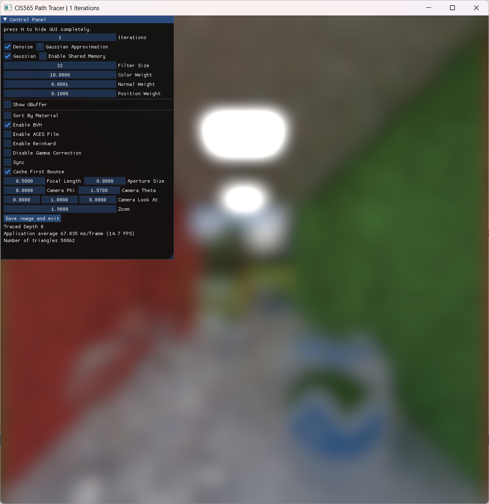
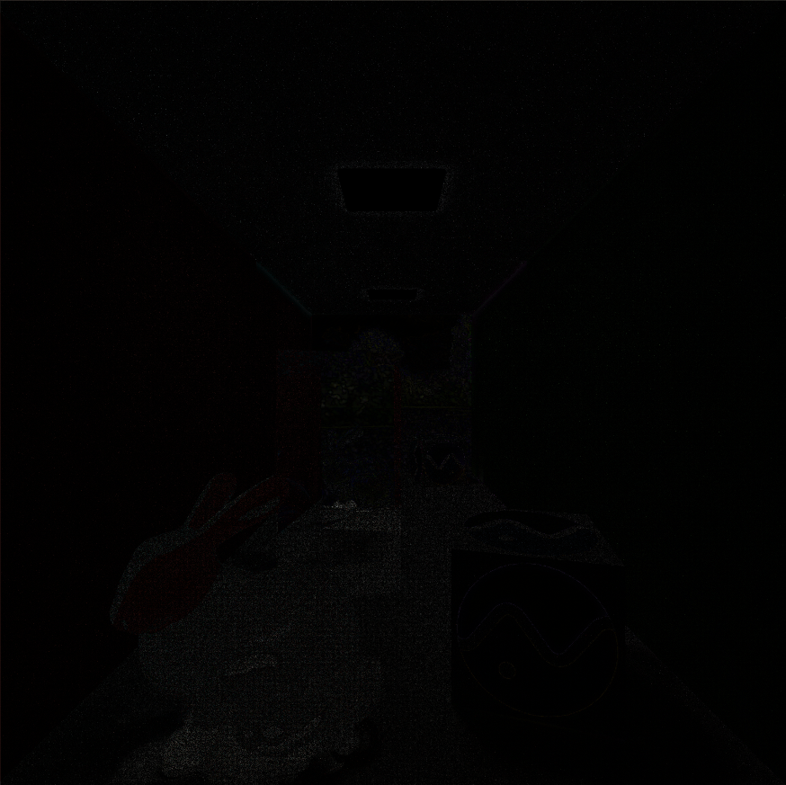

CUDA Denoiser For CUDA Path Tracer
==================================

**University of Pennsylvania, CIS 565: GPU Programming and Architecture, Project 4**

* Gehan Zheng
  * [LinkedIn](https://www.linkedin.com/in/gehan-zheng-05877b24a/), [personal website](https://grahamzen.github.io/).
* Tested on: Windows 11, AMD Ryzen 7 5800H @ 3.2GHz 16GB, GeForce RTX 3060 Laptop 6144MB (Personal Laptop)

## Overview

Monte Carlo path tracing is a powerful tool for rendering photorealistic images. However, a potential problem is that the speed of convergence is $O(\frac{1}{\sqrt{N}})$, where $N$ is the number of samples. This means that the number of samples required to achieve a certain level of noise is proportional to the square of the desired noise level. To solve this problem, we can use a denoiser to reduce the noise in the image.

Here are the features I implemented in this project:

* A-trous wavelet filter.
* G-Buffer optimization
* Gaussian filtering
* Shared Memory Filtering

### Edge-Avoiding À-Trous Wavelet Transform

In this project, I implemented the edge-avoiding À-Trous wavelet transform denoising algorithm based on the paper [Edge-Avoiding À-Trous Wavelet Transform for fast Global Illumination Filtering](https://jo.dreggn.org/home/2010_atrous.pdf). The idea is very simple. There are three steps in this algorithm.

1. At the first iteration of path tracing, we store the hit position and normal of each ray in a G-buffer.
2. After path tracing, we get the final image.
3. Finally, we use the G-buffer and the final image to perform the denoising algorithm.

| G-Buffer                                       | Final Image                                    | Denoised Image                                 |
| ---------------------------------------------- | ---------------------------------------------- | ---------------------------------------------- |
|  |  |  |

<em>Figure 1: Result of the denoising algorithm (parameters are shown in the figure)</em>

A-trous kernel without weighting is an approximation of Gaussian kernel. Here is a comparison between Gaussian filter and approximate Gaussian filter.

| Gaussian Filter                                | Gaussian Filter(A-Trous Filter)                |
| ---------------------------------------------- | ---------------------------------------------- |
|  |  |

<em>Figure 2: Comparison between Gaussian filter and approximate Gaussian filter</em>

Here is a result when more iterations are used.

| Final Image                                    | Denoised Image                                 |
| ---------------------------------------------- | ---------------------------------------------- |
|  |  |

<em>Figure 3: Comparison between image with and without denoising</em>

### G-Buffer Optimization

In the previous section, I mentioned that we need to store the hit position and normal of each ray in a G-buffer. These are two vec3 variables. Since we can't compute position from the depth buffer when we use either anti-aliasing or depth of field, we need to store the position of each ray in the G-buffer. On the other hand, we can convert the normal to a 2D vector and store it in the G-buffer. [Oct-encoding normals](http://jcgt.org/published/0003/02/01/paper.pdf) gives us a way to convert a unit vector to a 2D vector.

### Gaussian Filtering

To apply Gaussian filtering, we need to compute the Gaussian kernel. Since the kernel size is arbitrary, and computing the kernel is not time-consuming compared to accessing the global memory, I compute the value of the kernel in the kernel function instead of using a precomputed kernel.

### Shared Memory Filtering

I tried to use shared memory to optimize two kernels: `ATrousFilterGaussKern` and `gaussianFilterKern`.

**Gaussian Filter**

In the convolution process with a Gaussian kernel, there is a high degree of overlap in the region accessed by each thread in a block, so shared memory can be used to store the entire region that each thread within a block will access. Then, each thread can access the shared memory to get the value of the kernel to perform the convolution.

**ATrous Filter**

This part is a little bit tricky because when step width is different, the pattern of accessed region is different. For step width less than block size, there is a high degree of overlap in the region accessed by each thread in a block just like the Gaussian filter. However, when the step width is larger than the block size, each thread in a block will access a totally different region. To maximize the performance, we need two different kernels, one for step width less than block size and one for step width larger than block size. The following figure, courtesy of [Chang](https://github.com/HummaWhite/Project4-CUDA-Denoiser), shows the access pattern of the kernel。

<em>Figure 4: Illustration of the access pattern of the kernel</em>

In both kernel, we need to access the G-buffer and final image. We can preload the G-buffer and final image into shared memory. Then, each thread can access the shared memory to get the value of the kernel to perform the convolution. For kernels with step width less than block size, I use the same way to load data into shared memory as the Gaussian filter:

1. First we determine the size of the shared memory and the number of threads in a block, which is (BLOCK_SIZE + $4\times$step width) * (BLOCK_SIZE + $4\times$step width) and BLOCK_SIZE * BLOCK_SIZE respectively. 
2. Divide the size by BLOCK_SIZE * BLOCK_SIZE to get the number of iterations required to load the data into shared memory.
3. Compute the x index and y index of each thread.
4. Store the data in the shared memory.

In this way, we can load data with arbitrary size into shared memory.

For kernels with step width larger than block size, however, the access pattern is not regular, so we need to rearrange the data in the shared memory to reduce the required shared memory size. Since each region accessed by each thread does not overlap, there are 5*5=25 regions in total. Each region contains $block size * block size$ elements. Therefore, we can loop through the 25 regions and load the data into shared memory.

Notice that the memory access pattern in this approach is identical to that in the kernel function without using shared memory. In other words, this process merely involves reading data from global memory into shared memory and then accessing it again from shared memory, resulting in no actual efficiency improvement. However, since each thread in a block will never access the same region and access pattern is interleaved, shared memory is not useful in this case. On the contrary, it will reduce the performance because it requires shared memory and block size is limited, resulting in lower occupancy.

## GUI Controls

Since the denoiser is implemented in the path tracer from the previous project, some GUI controls are inherited from the previous project. Aside from those controls and the controls originally in the base code, I added the following controls:

* **Denoise**: Enable or disable the denoiser.
After enabling the denoiser, these controls will be available:
* **Gaussian Approximation**: Enable or disable the Gaussian approximation based on A-trous wavelet transform.
* **Gaussian Filter**: Enable or disable the Gaussian filter.
* **Enable Shared Memory**: Enable or disable the shared memory optimization, which works for both Gaussian filter and A-trous wavelet transform.

## Performance Analysis

### Time Analysis

#### Performance of Different Filter Size and Resolution

In this algorithm, the number of convolution operations is proportional to the logarithm of the filter size. As can also be seen from the figure below, with an increase in filter size, the execution time for the same resolution grows at a nearly logarithmic scale. However, for lower resolutions, the execution time remains almost unchanged even with a significant increase in filter size, while higher resolutions show a noticeable increase in execution time. This is because at lower resolutions, even with a large filter size, the accessed pixels extend beyond the image boundaries, leading to certain calculation steps being skipped. In contrast, larger images require the full calculation process.

#### How denoising influences the number of iterations needed to get an "acceptably smooth" result

| 250 iterations | 250 iterations (denoised) |
| -------------- | ------------------------ |
|  |  |

| 5000 iterations | difference(5000 vs 250 denoised) |
| --------------- | -------------------------------- |
|  |  |

From the image, it can be seen that apart from the glass material, after denoising with 250 iterations, the rendering effects of other materials are already very close to the results of 5000 iterations. Therefore, it can be conservatively estimated that denoising can yield an "acceptably smooth" result with a reduction of about 90% in iteration count.

#### G-Buffer Optimization

Reducing the memory size of `GbufferPixel` can decrease the memory access time in kernel functions, as CUDA employs the memory coalesce method to access global memory. A smaller `GbufferPixel` memory size implies that more `GbufferPixel`s can be fetched in a single memory access, thereby significantly reducing I/O overhead. Substituting the `pos` of `GbufferPixel` with `t` should yield further improvement, but in practice, since the resulting generation will definitely utilize anti-aliasing, this optimization cannot be employed after the substitution, so I did not implement this optimization. From the figure below, we can see that for larger filter size, the execution time decreases when G-buffer optimization is enabled.

#### Shared Memory Optimization

This section includes a comparison of optimizing the Gaussian filtering and À-Trous wavelet transform denoising algorithm using shared memory. 

**Gaussian filtering**

For Gaussian filtering, it seems that shared memory could effectively improve memory access efficiency and thereby shorten execution time. However, the results do not reflect this; there's only a minor improvement when the filter size is 2, and when the filter size exceeds a certain amount (13 when block size=4), the shared memory version fails to work since its memory size is insufficient to store all pixels needed for access. Moreover, as the increase in block size leads to an increased demand for shared memory, a larger block size cannot be selected. In contrast, using global memory has no such restriction. It can be seen from the graph that different block sizes have a significant impact on execution time, so the shared memory version has no advantage.

In fact, the core reason that the shared memory version is slower than the global memory version with the same block size is the inadequacy of the L1 cache. L1 cache and shared memory use the same part of memory. I attempted to replace the content of the kernel function of the shared memory version with that of the global memory version while retaining the shared memory allocation. The result was an execution time of around 144ms when filter size = 8. This implies that merely allocating shared memory, which occupies the L1 cache, leads to greater global memory access overhead, slowing down the process significantly. This issue is also pointed out in the profile of nsight compute.

Therefore, even in the Gaussian filtering algorithm where memory access overlaps exist, optimizing with shared memory still yields poor results. Based on the above information, if optimization with shared memory leads to improvement, then firstly, the size of shared memory allocated to each block should be sufficient, rather than, as in my current usage, almost reaching the limit of shared memory size when launching the kernel. Additionally, after allocating shared memory, it's necessary to ensure an appropriate size of L1 cache to avoid increasing the I/O overhead of reading global memory.

Furthermore, it can be observed from the graph that among the comparison subjects, using À-Trous to estimate the Gaussian filtering result is the fastest. This is because it does not require access to the entire neighborhood, but instead performs log2(n) convolutions, with each thread accessing at most 25 elements each time, making it extremely efficient. Moreover, the results have only a minor difference compared to Gaussian filtering.

**À-Trous wavelet transform denoising algorithm**

Based on the analysis above, for the À-Trous wavelet transform denoising algorithm, the results are similar (insufficiency of L1 cache). What's worse, this algorithm does not have overlapping memory accesses. Although the size requirement of shared memory relative to filter size is constant, it is O(block size), so it's still insufficient when the block size is large. The highest power of 2 block size I could use in testing was 4, which is foreseeable to lead to very low SM occupancy, and the results indeed reflect this. Even when compared to the global memory version with the same block size, the execution time of the shared memory version is roughly twice as long, which is consistent with the previous analysis of this algorithm.

### Quality Analysis

#### Varing Filter Size

The visual quality does not correspondingly improve with an increase in filter size, as increasing the filter size would cause a pixel to utilize information from further surrounding areas, which might instead lead to the loss of valuable information. The following images show that larger filter size results in a more blurred image.

|filter size = 1|filter size = 2|
|---------------|---------------|
|||

|filter size = 4|filter size = 8|
|---------------|---------------|
|||

|filter size = 16|filter size = 32|
|----------------|----------------|
|||

#### Different material types

The scene I tested above is complex, including reflections, refractions, and textures. The denoising algorithm used in this project inevitably leads to a certain loss of texture information, and because it only uses the information from the first ray hit, the information obtained for points hitting mirror reflections is not accurate. Therefore, it can be observed that the reflection of the skybox on the back wall has become significantly blurred. Additionally, many noise points on the surface of the glass material rabbit have not been removed. Results of a scene with simpler materials are shown in the next section.

#### Different scenes

A very apparent hypothesis about how different scenes impact the denoised result is that with the same denoising parameters, the simpler the materials in the scene, such as those without mirror reflections or refractions, the higher the quality of rendering results can be achieved with fewer iterations. Another hypothesis is that in conditions where the lighting is dim or even without bright light sources, fewer iterations are needed to achieve high-quality rendering results. This is because bright light sources can cause bright spots, which would be more noticeable with fewer iterations even after denoising. Both hypotheses are verified by the following results.

Here two simple scenes with no mirror reflections or refractions. The first scene has a bright light source, while the second scene does not. For the first scene, 100 iterations are needed to achieve a smooth result, while for the second scene, only 1 iterations are needed.

|Parameters|W/ light|W/o light|
|--------------|------------| ------------|
|Iterations|100|1|
|Color weight|100|10|
|Normal weight|0.0001|0.0001|
|Position weight|0.05|0.1|
|Filter size|32|32|
|Result|||

If we render the first scene with 1 iteration, the parameters need to be tuned to achieve a smooth result. However, as can be seen from the figure below, the quality is still not as good as the result of the second scene with 1 iteration.

|Parameters|W/ light|W/o light|
|--------------|------------| ------------|
|Iterations|1|1|
|Color weight|100|10|
|Normal weight|0.0001|0.0001|
|Position weight|0.1|0.1|
|Filter size|32|32|
|Result|||
